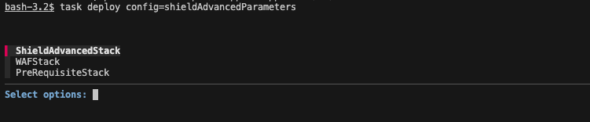

## 🛡️ Deployment

### ⚙️ Prerequisites
1. [Organizations trusted access with Firewall Manager](https://docs.aws.amazon.com/organizations/latest/userguide/services-that-can-integrate-fms.html)
2. [Taskfile](https://taskfile.dev/)
3. [AWS CDK](https://aws.amazon.com/cdk/)
4. [Sops](https://github.com/getsops/sops)
5. [cfn-dia](https://www.npmjs.com/package/@mhlabs/cfn-diagram?s=03)
6. Invoke `npm i` to install dependencies
7. ⚠️ Before installing a stack to your aws account using aws cdk you need to prepare the account using a [cdk bootstrap](https://docs.aws.amazon.com/cdk/v2/guide/bootstrapping.html)

8. (Optional) If you want to use CloudWatch Dashboards (both Shield or Firewall) - You need to enable your target accounts to share CloudWatch data with the central security account follow [this](https://docs.aws.amazon.com/AmazonCloudWatch/latest/monitoring/Cross-Account-Cross-Region.html#enable-cross-account-cross-Region) to see how to do it, or use the templates from here:
    - [Monitoring account template](./static/cf-templates/monitoring-account-sink.template.yml)
    - [Source account template](./static/cf-templates/cross_account_cw_stack.template.yml)

9. (Optional) If you want to use the UnutilizedWafs Feature -  You need to enable your target accounts with a Cross Account Role - You can find an example CfnTemplate you can use [here](static/cf-templates/cross_account_roles_unutilized_wafs.yaml).
10. Assume AWS Profile `awsume PROFILENAME`
11. (Optional) Enter `task generateprerequisitesconfig`

  | Parameter  | Value |
  | ------------- | ------------- |
  | Prefix  | Prefix for all Resources  |
  | BucketName [^1] | Name of the S3 Bucket |
  | KmsEncryptionKey | true or false  |
  | ObjectLock - Days [^1]| A period of Days for ObjectLock |
  | ObjectLock - Mode [^1]| COMPLIANCE or GOVERNANCE |
  | FireHoseKey - KeyAlias [^1] | Alias for Key |
  | CrossAccountIdforPermissions [^1] | Id of AWS Account for CrossAccount Permission for Bucket and KMS Key(s)|

12. When Deploying from a CI/CD pipeline, set an environment variable STACK_NAME to specify which resources to deploy.
      - `export STACK_NAME=PreRequisiteStack` => _prerequisites-stack.ts
      - `export STACK_NAME=WAFStack` => _web-application-firewall-stack.ts
      - `export STACK_NAME=ShieldAdvancedStack` => _shield-advanced-stack.ts
13. Enter `task deploy config=NAMEOFYOURCONFIGFILE`
14. If STACK_NAME isn't set yet, select the type of resource to be deployed (Pre-requisite Stacks, WAF or Shield Advanced)
  
### 🏁 Deployment via Taskfile

1. Create new ts file for you WAF and configure Rules in the Configuration (see [owasptopten.ts](values/examples/owasptop10.ts) to see structure) or use enter `task generate-waf-skeleton`

2. Assume AWS Profile `awsume / assume PROFILENAME`
3. (Optional) 
   1. Enter `task generate-waf-skeleton`
   2. Enter `task generate-shield-skeleton`
4. When Deploying from a CI/CD pipeline, set an environment variable STACK_NAME to specify which resources to deploy.
    - `export STACK_NAME=PreRequisiteStack` => _prerequisites-stack.ts
    - `export STACK_NAME=WAFStack` => _web-application-firewall-stack.ts
    - `export STACK_NAME=ShieldAdvancedStack` => _shield-advanced-stack.ts
5. Enter `task deploy config=NAMEOFYOURCONFIGFILE`
6. If STACK_NAME isn't set yet, select the type of resource to be deployed (Pre-requisite Stacks, WAF or Shield Advanced)
  
  