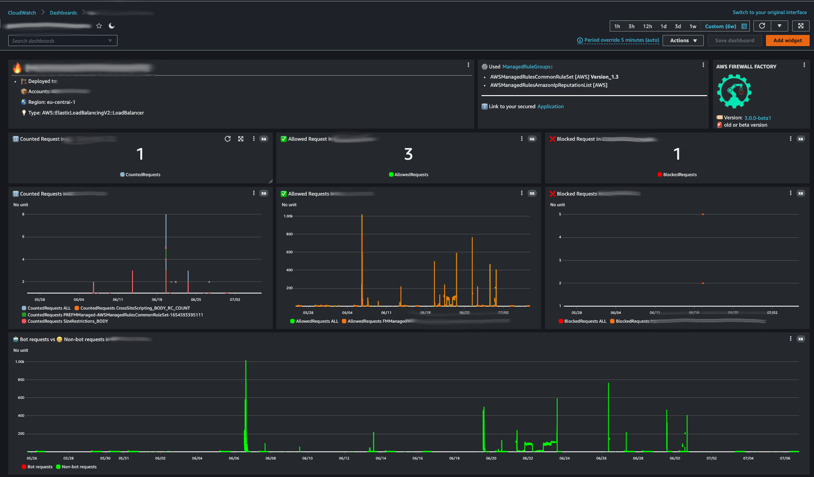

## 🧩 Features

1. Automated capactiy calculation via [API - CheckCapacity](https://docs.aws.amazon.com/waf/latest/APIReference/API_CheckCapacity.html)

2. Algorithm to split Rules into RuleGroups

3. Automated update of RuleGroup if capacity changed

4. Add [ManagedRuleGroups](https://docs.aws.amazon.com/waf/latest/developerguide/aws-managed-rule-groups-list.html) via configuration file

5. Automated generation of draw.io [diagram](https://app.diagrams.net/) for each WAF

6. Checking of the softlimit quota for [WCU](https://docs.aws.amazon.com/waf/latest/developerguide/how-aws-waf-works.html) set in the AWS account (stop deployment if calculated WCU is above the quota)

7. Easy configuration of WAF rules trough Typescript file.
   
8. Deploy same WAF more than once for testing and/or blue/green deployments.

9.  Stopping deployment if soft limit will be exceeded:  **Firewall Manager policies per organization per Region (L-0B28E140)** - **Maximum number of web ACL capacity units in a web ACL in WAF for regional (L-D9F31E8A)**

10. You can name your rules. If you define a name in your RulesArray, the name + a Base36 timestamp will be used for the creation of your rule - otherwise a name will be generated. This will help you to query your logs in Athena.

11. Support for Captcha - You can add Captcha as an action to your WAFs. This helps you block unwanted bot traffic by requiring users to successfully complete challenges before their web request are allowed to reach AWS WAF protected resources. AWS WAF Captcha is available in the US East (N. Virginia), US West (Oregon), Europe (Frankfurt), South America (Sao Paulo), and Asia Pacific (Singapore) AWS Regions and supports Application Load Balancer, Amazon API Gateway, and AWS AppSync resources.

12. Added S3LoggingBucketName to Configuration. You need to specify the S3 Bucket where logs should be placed in. We also added a prefix for the logs to be AWS conform (Prefix: AWSLogs/*AWS_ACCOUNTID*/FirewallManager/*AWS_REGION*/).

13. Added testing your WAF with [GoTestWAF](https://github.com/wallarm/gotestwaf). To be able to check your WAF we introduced the **SecuredDomain** parameter in the Configuration (which should be your domain) which will be checked using the WAF tool.

14. TaskFileParameters:

    |     Parameter      |                                           Value                                              |
    |--------------------|----------------------------------------------------------------------------------------------|
    | SKIP_QUOTA_CHECK   | true (Stop deployment if calculated WCU is above the quota)   false (Skipping WCU Check) |
    | WAF_TEST           | true (testing your waf with GoTestWAF)   false (Skipping WAF testing)                    |
    | CREATE_DIAGRAM     | true (generating a diagram using draw.io)   false (Skipping diagram generation)          |
    | PREQUISITES        | true (deploys Prerequisites Stack)   false (deployment of WAF)           |
    | TOOL_KIT_STACKNAME        | To Specify The name of the bootstrap stack ([see Bootstrapping your AWS environment](https://docs.aws.amazon.com/cdk/v2/guide/cli.html#cli-bootstrap))       |

15. Validation of your ConfigFile using schema validation - if you miss a required parameter in your config file the deployment will stop automatically and show you the missing path.

16. PreProcess- and PostProcessRuleGroups - you can decide now where the Custom or ManagedRules should be added to.

    - New Structure see [example Configuration](./values/examples).

17. RuleLabels - A label is a string made up of a prefix, optional namespaces and a name. The components of a label are delimited with a colon. Labels have the following requirements and characteristics:

    - Labels are case-sensitive.

    - Each label namespace or label name can have up to 128 characters.

    - You can specify up to five namespaces in a label.

    - Components of a label are separated by a colon ( : ).

18. While Deployment the Price for your WAF will be calculated using the Pricing API

19. Dashboard - The Firewall Factory is able to provision a CloudWatch Dashboard per Firewall.
  The Dashboard shows:
    - Where the WAF is deployed to [AWS Region and Account(s)]
    - Which resource type you are securing
    - Which Managed Rule Groups in which version are in use
    - Link to Managed Rule Groups documentation
    - Direct Link to your secured Application / Endpoint
    - AWS Firewall Factory version
    - Check if the AWS Firewall Factory version is the latest or not during rollout
    - Allowed / Blocked and Counted Requests
    - Bot vs Non-bot Requests

See example:

20. Example Configurations
    1.  Example WAF Configuration againts: [OWASP Top Ten](https://owasp.org/www-project-top-ten/)
    2.  Example Configuration for Prerequisite Stack
    3.  Function to generate Skeleton for WAF Configuration

21.   Centralized IPSets management -  No more we'll have to be manually updating ipsets across multiple AWS accounts, it can be defined in code and replicated for use by WAF rules everywhere its needed. Check the examples for defining ipsets and using them in the WebACLs on `values/examples/ip-sets-managed-test.ts`.

22. Centralized management of RegexPatternSets - No longer will there be a need for manual updates of RegexPatternSets across multiple AWS accounts. These can now be defined in code and replicated for use by WAF rules wherever needed.

