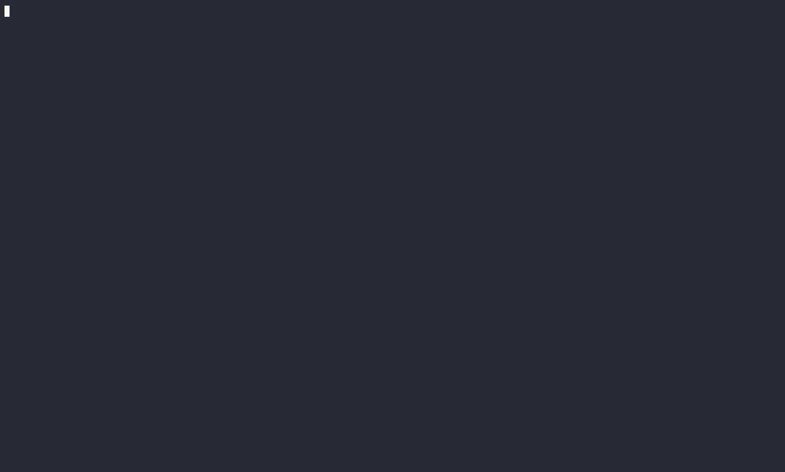
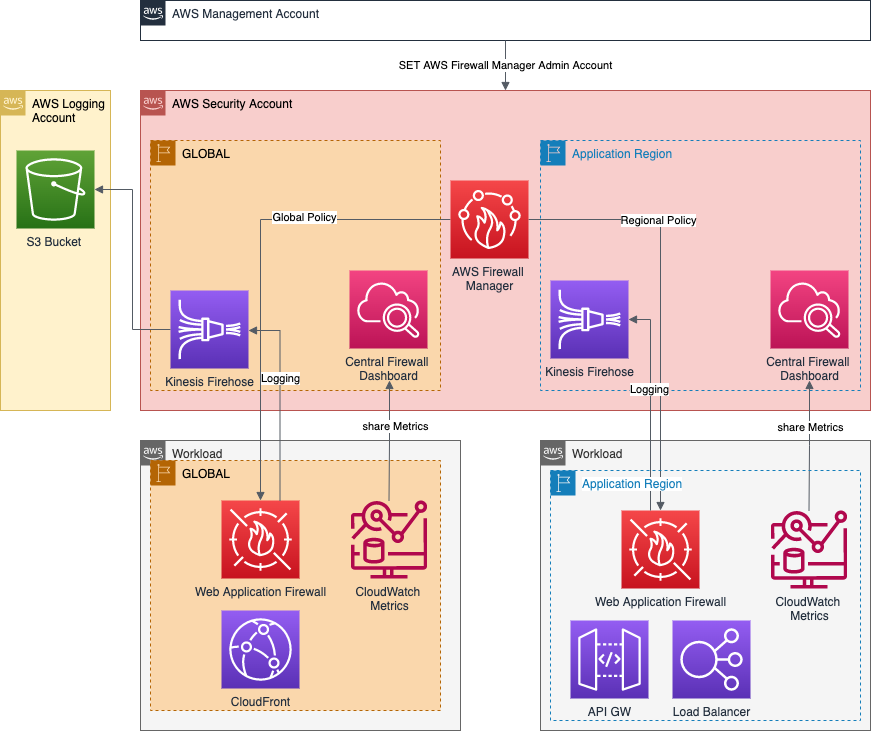

 

 

**[🚧 Feature request](https://github.com/globaldatanet/aws-firewall-factory/issues/new?assignees=&labels=feature-request%2C+enhancement&template=feature_request.md&title=)** | **[🐛 Bug Report](https://github.com/globaldatanet/aws-firewall-factory/issues/new?assignees=&labels=bug%2C+triage&template=bug_report.md&title=)**

## 𒋰 Table of contents

- [𒋰 Table of contents](#𒋰-table-of-contents)
- [🔭 Overview](#-overview)
- [🎬 Media](#-media)
    - [🔗 Useful Links](#-useful-links)
- [🗺️ Architecture](#️-architecture)
- [🧪 Tests](#-tests)
- [🦸🏼‍♀️ Contributors](#️-contributors)
  - [👩‍💻 Contribute](#-contribute)
  - [👏 Supporters](#-supporters)

|                     Releases                      | Author |
|---------------------------------------------------|--------|
| [Changelog](CHANGELOG.md) - [Features](Features.md) - [🛡️ Deployment](Deployment.md) | David Krohn   [Linkedin](https://www.linkedin.com/in/daknhh/) - [Blog](https://globaldatanet.com/our-team/david-krohn)|

 

## 🔭 Overview

AWS Web Application Firewalls (WAFs) protect web applications and APIs from typical attacks from the Internet that can compromise security and availability, and put undue strain on servers and resources. The AWS WAF provides prebuilt security rules that help control bot traffic and block attack patterns. You can also create your own rules based on your own requirements. In simple scenarios and for smaller applications, this is very easy to implement on an individual basis. However, in larger environments with tens or even hundreds of applications, it is advisable to aim for central governance and automation. This simple solution helps you deploy, update and stage your Web Application Firewalls while managing them centrally via AWS Firewall Manager.

## 🎬 Media

If you want to learn more about the AWS Firewall Factory feel free to look at the following media resources.

- [📺 Webinar: Web Application Firewalls at Scale - Language: 🇩🇪](https://globaldatanet.com/webinars/aws-security-with-security-in-the-cloud)
- [📺 Webinar: Managing AWS Web Application Firewalls at Scale - Language: 🇺🇸](https://globaldatanet.com/webinars/managing-aws-web-application-firewalls-at-scale)
- [📺 Webinar: Secure Serverless Applications against OWASP TOP 10 in 5 mins - Language: 🇺🇸](https://serverless-summit.io/)
- [📊 Slides: Managing AWS Web Application Firewalls at Scale - Language: 🇺🇸](https://docs.google.com/presentation/d/1jE_DmNk0cCc1XM8eBYPM2za0pzGyg9Lv/edit?usp=sharing&ouid=115444461121738087344&rtpof=true&sd=true)
- Secure Serverless Applications against OWASP TOP 10 in 5 Minutes - Language: 🇺🇸
  - [📊 Slides](https://docs.google.com/file/d/1YJCfTt8ILa2R9n23fHDFLpfLhTwhB4ea/edit?filetype=mspresentation) - [📺 Video](https://www.youtube.com/watch?v=jrYpr0DLKfo)
- [🎙 Podcast coming soon](https://github.com/richarvey/aws-community-radio/issues/3)

#### 🔗 Useful Links

- [🐦🤖 Twitter Bot to get Notified for Managed Rules Updates](https://twitter.com/AWSMgMtRulesBot)
- [🏫 AWS WAF Workshop](https://catalog.us-east-1.prod.workshops.aws/workshops/c2f03000-cf61-42a6-8e62-9eaf04907417/en-US/02-custom-rules)
## 🗺️ Architecture

## 🧪 Tests
|  Test | Status  |
|---|---|
|  Linting |   |
|  WAF Deployment - Only Managed Rule Groups  |   |
|  WAF Deployment - IpSets |    |
|  WAF Deployment - RegexPatternSets |   |

## 🦸🏼‍♀️ Contributors

 
Any form of contribution is welcome. The above contributors have been officially released by globaldatanet.
 
 

### 👩‍💻 Contribute

Want to contribute to **AWS FIREWALL FACTORY**? Check out the [Contribution docs](./CONTRIBUTING.md)
 

### 👏 Supporters

 

[^1]: Optional Fields. 
