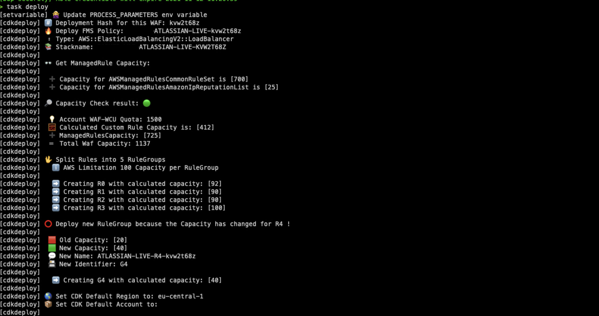

# AWS FIREWALL FACTORY

 

 

AWS Web Application Firewalls (WAFs) protect web applications and APIs from typical attacks from the Internet that can compromise security and availability, and put undue strain on servers and resources. The AWS WAF provides prebuilt security rules that help control bot traffic and block attack patterns. However, with its help, you can also create your own rules based on your specific requirements. In simple scenarios and for smaller applications, this is very easy to implement on an individual basis. However, in larger environments with tens or even hundreds of applications, it is advisable to aim for central governance and automation. This simple solution helps you deploy, update, and stage your Web Application Firewalls while managing them centrally via AWS Firewall Manager

 

- [AWS FIREWALL FACTORY](#aws-firewall-factory)
    + [Media](#media)
  * [Architecture](#architecture)
    + [Prerequisites](#prerequisites-)
  * [Features](#features)
    + [Coming soon](#coming-soon-)
  * [Deployment via Taskfile](#deployment-via-taskfile)
  * [👏 Supporters](#---supporters)

|Releases |Author  | 
--- | --- |
| [Changelog](CHANGELOG.md) - [Features](#Features)| David Krohn   [Linkedin](https://www.linkedin.com/in/daknhh/) - [Blog](https://globaldatanet.com/our-team/david-krohn)|

### Media
If you want to learn something more about the AWS Firewall Factory feel free to look at the following media resources.

- [📺 Webinar: Web Application Firewalls at Scale](https://globaldatanet.com/webinars/aws-security-with-security-in-the-cloud)
- [🎙 Podcast coming soon](https://github.com/richarvey/aws-community-radio/issues/3)
## Architecture

### Prerequisites
1. An central S3 Bucket with **write** permission for security account needs to be in place.

## Features

1. Automated Capactiy Calculation via [API - CheckCapacity](https://docs.aws.amazon.com/waf/latest/APIReference/API_CheckCapacity.html)
2. Algorithm to split Rules into RuleGroups
3. Automated Update of RuleGroup if Capacity Changed
4. Add [ManagedRuleGroups](https://docs.aws.amazon.com/waf/latest/developerguide/aws-managed-rule-groups-list.html) via configuration file
5. Automated Generation of draw.io [diagram](https://app.diagrams.net/) for each WAF
6. Checking of the softlimit quota for WCU set in the AWS Account (Stop deployment if Caluclated WCU is above the quota)
7. Easy configuration of WAF Rules trough json file.
8. Deployment Hash to deploy same WAF more than one time for testing and/or blue/green deployments.
9. Stopping deployment if soft limit will be exceeded:  **Firewall Manager policies per organization per Region (L-0B28E140)** - **Maximum number of web ACL capacity units in a web ACL in WAF for regional (L-D9F31E8A)**
10. **RegexMatchStatement** and **IPSetReferenceStatement** is working now 🚀
11. You can name your Rules. If you define a Name in your RulesArray the Name + a Base36 Timestamp will be used for creation of your Rule - otherwise a name will be generated. This will help you to query your logs in Athena. The same Rulename also apply to the metric just with adding "-metric" to the name.
12. Support for Captcha - You can add Captcha as Action to your WAFs. This help you to block unwanted bot traffic by requiring users to successfully complete challenges before their web request are allowed to reach AWS WAF protected resources. AWS WAF Captcha is available in the US East (N. Virginia), US West (Oregon), Europe (Frankfurt), South America (Sao Paulo), and Asia Pacific (Singapore) AWS Regions and supports Application Load Balancer, Amazon API Gateway, and AWS AppSync resources.
13. Added S3LoggingBucketName to json. You need to specify the S3 Bucket where the Logs should be placed in now. We also added a Prefix for the logs to be aws conform (Prefix: AWSLogs/AWS_ACCOUNTID/FirewallManager/AWS_REGION/).
14. Added Testing your WAF with [GoTestWAF](https://github.com/wallarm/gotestwaf). To be able to check your waf we introduced the **SecuredDomain** Parameter in the json which should be your Domain which will be checked using the WAF tool.
15. Introduced three new Parameters in the taskfile (**WAF_TEST**,**CREATE_DIAGRAM** and **CDK_DIFF**).

| Parameter   |      Value      |
|----------|:-------------:|
| WAF_TEST |  true (testing your waf with GoTestWAF)   false (Skipping WAF testing)  |
| CREATE_DIAGRAM |  true (generating a diagram using draw.io)   false (Skipping diagram generation)  |
| CDK_DIFF |  true (generating a cdk before invoking cdk deploy)   false (Skipping cdk diff)  |

16. Validation of your ConfigFile using Schema validation - if you miss an required parameter in your config file the deployment will stop automatically and show you the missing path.
17. PreProcess-and PostProcessRuleGroups - you can decide now where the Custom or ManagedRules should be added to.

- New Structure see [example json](./values/example-waf.json).

18. RuleLabels - A label is a string made up of a prefix, optional namespaces, and a name. The components of a label are delimited with a colon. Labels have the following requirements and characteristics:

    - Labels are case-sensitive.

    - Each label namespace or label name can have up to 128 characters.

    - You can specify up to five namespaces in a label.

    - Components of a label are separated by colon (:).

### Coming soon:

1. Deployment via Teamcity 

## Deployment via Taskfile

0. Create new json file for you WAF and configure Rules in the JSON (see [example.json](values/example-waf.json) to see structure)
1. Set `PROCESS_PARAMETERS` in `Taskfile.yml` for new json file
2. Assume AWS Profile `awsume PROFILENAME`
3. Enter `task deploy`

### 👏 Supporters

 

