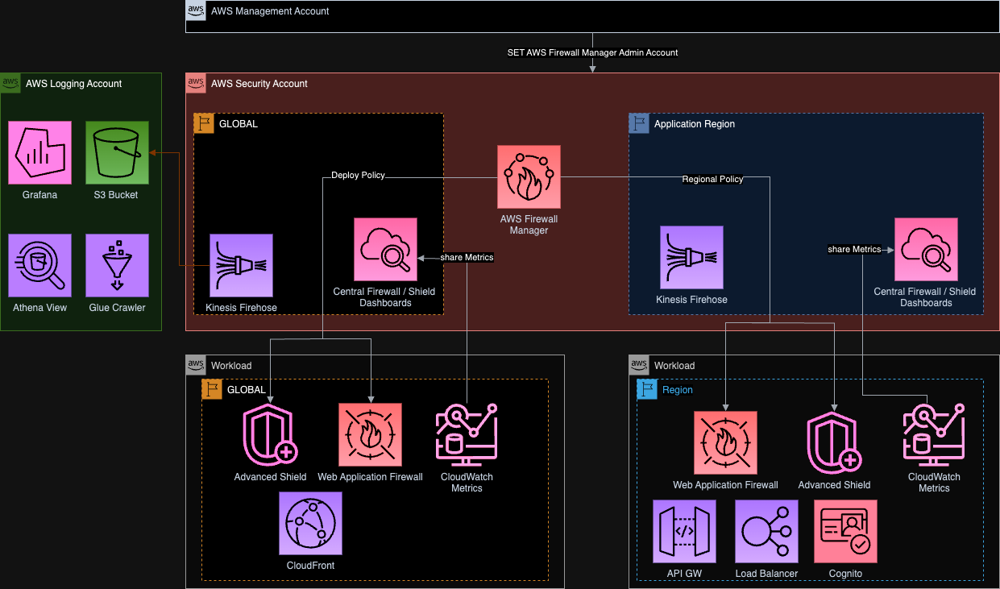

 

 

**[🚧 Feature request](https://github.com/globaldatanet/aws-firewall-factory/issues/new?assignees=&labels=feature-request%2C+enhancement&template=feature_request.md&title=)** | **[🐛 Bug Report](https://github.com/globaldatanet/aws-firewall-factory/issues/new?assignees=&labels=bug%2C+triage&template=bug_report.md&title=)**

## 𒋰 Table of contents

- [𒋰 Table of contents](#𒋰-table-of-contents)
- [🔭 Overview](#-overview)
- [🎬 Media](#-media)
    - [🔗 Useful Links](#-useful-links)
- [🗺️ Architecture](#️-architecture)
- [🧩 Features](#-features)
- [🛡️ Deployment](#️-deployment)
  - [⚙️ Prerequisites](#️-prerequisites)
  - [🏁 Deployment via Taskfile](#-deployment-via-taskfile)
- [🦸🏼‍♀️ Contributors](#️-contributors)
  - [👩‍💻 Contribute](#-contribute)
  - [👏 Supporters](#-supporters)

 

|                     Releases                      | Author |
|---------------------------------------------------|--------|
| [Changelog](CHANGELOG.md) - [Features](#Features) | David Krohn   [Linkedin](https://www.linkedin.com/in/daknhh/) - [Blog](https://globaldatanet.com/our-team/david-krohn)|

 

## 🔭 Overview

AWS Web Application Firewalls (WAFs) protect web applications and APIs from typical attacks from the Internet that can compromise security and availability, and put undue strain on servers and resources. The AWS WAF provides prebuilt security rules that help control bot traffic and block attack patterns. You can also create your own rules based on your own requirements. In simple scenarios and for smaller applications, this is very easy to implement on an individual basis. However, in larger environments with tens or even hundreds of applications, it is advisable to aim for central governance and automation. This simple solution helps you deploy, update and stage your Web Application Firewalls while managing them centrally via AWS Firewall Manager.

## 🎬 Media

If you want to learn more about the AWS Firewall Factory feel free to look at the following media resources.

- [📺 Webinar: Web Application Firewalls at Scale - Language: 🇩🇪](https://globaldatanet.com/webinars/aws-security-with-security-in-the-cloud)
- [📺 Webinar: Managing AWS Web Application Firewalls at Scale - Language: 🇺🇸](https://globaldatanet.com/webinars/managing-aws-web-application-firewalls-at-scale)
- [📊 Slides: Managing AWS Web Application Firewalls at Scale - Language: 🇺🇸](https://docs.google.com/presentation/d/1jE_DmNk0cCc1XM8eBYPM2za0pzGyg9Lv/edit?usp=sharing&ouid=115444461121738087344&rtpof=true&sd=true)
- Secure Serverless Applications against OWASP TOP 10 in 5 Minutes - Language: 🇺🇸
  - [📊 Slides](https://docs.google.com/file/d/1YJCfTt8ILa2R9n23fHDFLpfLhTwhB4ea/edit?filetype=mspresentation) - [📺 Video](https://www.youtube.com/watch?v=jrYpr0DLKfo)
- [🎙 Podcast coming soon](https://github.com/richarvey/aws-community-radio/issues/3)

#### 🔗 Useful Links

- [🐦🤖 Twitter Bot to get Notified for Managed Rules Updates](https://twitter.com/AWSMgMtRulesBot)
- [🔔 Slack automation to get Notified for Managed Rules Updates](https://github.com/globaldatanet/WAF-Managed-Rules-Update-Slack-Notification-Service)
- [🏫 AWS WAF Workshop](https://catalog.us-east-1.prod.workshops.aws/workshops/c2f03000-cf61-42a6-8e62-9eaf04907417/en-US/02-custom-rules)
## 🗺️ Architecture

    
 Features

   

## 🧩 Features

1. Automated capactiy calculation via [API - CheckCapacity](https://docs.aws.amazon.com/waf/latest/APIReference/API_CheckCapacity.html)

2. Algorithm to split Rules into RuleGroups

3. Automated update of RuleGroup if capacity changed

4. Add [ManagedRuleGroups](https://docs.aws.amazon.com/waf/latest/developerguide/aws-managed-rule-groups-list.html) via configuration file

5. Automated generation of draw.io [diagram](https://app.diagrams.net/) for each WAF

6. Checking of the softlimit quota for [WCU](https://docs.aws.amazon.com/waf/latest/developerguide/how-aws-waf-works.html) set in the AWS account (stop deployment if calculated WCU is above the quota)

7. Easy configuration of WAF rules trough JSON file.

8. Deployment hash to deploy same WAF more than once for testing and/or blue/green deployments.

9. Stopping deployment if soft limit will be exceeded:  **Firewall Manager policies per organization per Region (L-0B28E140)** - **Maximum number of web ACL capacity units in a web ACL in WAF for regional (L-D9F31E8A)**

10. **RegexMatchStatement** and **IPSetReferenceStatement** is working now 🚀

11. You can name your rules. If you define a name in your RulesArray, the name + a Base36 timestamp will be used for the creation of your rule - otherwise a name will be generated. This will help you to query your logs in Athena. The same rule name also applies to the metric by adding "-metric" to the name.

12. Support for Captcha - You can add Captcha as an action to your WAFs. This helps you block unwanted bot traffic by requiring users to successfully complete challenges before their web request are allowed to reach AWS WAF protected resources. AWS WAF Captcha is available in the US East (N. Virginia), US West (Oregon), Europe (Frankfurt), South America (Sao Paulo), and Asia Pacific (Singapore) AWS Regions and supports Application Load Balancer, Amazon API Gateway, and AWS AppSync resources.

13. Added S3LoggingBucketName to JSON. You need to specify the S3 Bucket where logs should be placed in. We also added a prefix for the logs to be AWS conform (Prefix: AWSLogs/*AWS_ACCOUNTID*/FirewallManager/*AWS_REGION*/).

14. Added testing your WAF with [GoTestWAF](https://github.com/wallarm/gotestwaf). To be able to check your WAF we introduced the **SecuredDomain** parameter in the JSON (which should be your domain) which will be checked using the WAF tool.

15. TaskFileParameters:

    |     Parameter      |                                           Value                                              |
    |--------------------|----------------------------------------------------------------------------------------------|
    | SKIP_QUOTA_CHECK   | true (Stop deployment if calculated WCU is above the quota)   false (Skipping WCU Check) |
    | WAF_TEST           | true (testing your waf with GoTestWAF)   false (Skipping WAF testing)                    |
    | CREATE_DIAGRAM     | true (generating a diagram using draw.io)   false (Skipping diagram generation)          |
    | CDK_DIFF           | true (generating a cdk before invoking cdk deploy)   false (Skipping cdk diff)           |

16. Validation of your ConfigFile using schema validation - if you miss a required parameter in your config file the deployment will stop automatically and show you the missing path.

17. PreProcess- and PostProcessRuleGroups - you can decide now where the Custom or ManagedRules should be added to.

    - New Structure see [example json](./values/example-waf.json).

18. RuleLabels - A label is a string made up of a prefix, optional namespaces and a name. The components of a label are delimited with a colon. Labels have the following requirements and characteristics:

    - Labels are case-sensitive.

    - Each label namespace or label name can have up to 128 characters.

    - You can specify up to five namespaces in a label.

    - Components of a label are separated by a colon ( : ).

19. While Deployment the Price for your WAF will be calculated using the Pricing API

20. Dashboard - The Firewall Factory is able to provision a CloudWatch Dashboard per Firewall.
  The Dashboard shows:
    - Where the WAF is deployed to [AWS Region and Account(s)]
    - Which resource type you are securing
    - Which Managed Rule Groups in which version are in use
    - Link to Managed Rule Groups documentation
    - Direct Link to your secured Application / Endpoint
    - AWS Firewall Factory version
    - Check if the AWS Firewall Factory version is the latest or not during rollout
    - Allowed / Blocked and Counted Requests
    - Bot vs Non-bot Requests

See example:

21.   Centralized IPSets management -  No more we'll have to be manually updating ipsets across multiple AWS accounts, it can be defined in code and replicated for use by WAF rules everywhere its needed. Check the examples for defining ipsets and using them in the WebACLs on `values/ip-sets-managed.json`.

## 🛡️ Deployment

    
 Prerequisites

   

### ⚙️ Prerequisites
1. [Organizations trusted access with Firewall Manager](https://docs.aws.amazon.com/organizations/latest/userguide/services-that-can-integrate-fms.html)
2. [Taskfile](https://taskfile.dev/)
3. [AWS CDK](https://aws.amazon.com/cdk/)
4. [cfn-dia](https://www.npmjs.com/package/@mhlabs/cfn-diagram?s=03)
5. Invoke `npm i` to install dependencies
6. ⚠️ Before installing a stack to your aws account using aws cdk you need to prepare the account using a [cdk bootstrap](https://docs.aws.amazon.com/cdk/v2/guide/bootstrapping.html)

7. (Optional) If you want to use CloudWatch Dashboards - You need to enable your target accounts to share CloudWatch data with the central security account follow [this](https://docs.aws.amazon.com/AmazonCloudWatch/latest/monitoring/Cross-Account-Cross-Region.html#enable-cross-account-cross-Region) to see how to do it.
8. Assume AWS Profile `awsume PROFILENAME`
9. (Optional) Enter `task generateprerequisitesconfig`

  | Parameter  | Value |
  | ------------- | ------------- |
  | Prefix  | Prefix for all Resources  |
  | BucketName [^1] | Name of the S3 Bucket |
  | KmsEncryptionKey | true or false  |
  | ObjectLock - Days [^1]| A period of Days for ObjectLock |
  | ObjectLock - Mode [^1]| COMPLIANCE or GOVERNANCE |
  | FireHoseKey - KeyAlias [^1] | Alias for Key |
  | CrossAccountIdforPermissions [^1] | Id of AWS Account for CrossAccount Permission for Bucket and KMS Key(s)|

10. Enter `task deploy config=NAMEOFYOURCONFIGFILE prerequisite=true`

    
 Deployment via Taskfile 

   

### 🏁 Deployment via Taskfile

1. Create new json file for you WAF and configure Rules in the JSON (see [owasptopten.json](values/owasptopten.json) to see structure)

⚠️ When deploying a firewall for the first time, the **DeployHash** must be empty. The AWS Firewall Factory takes care of creating a DeployHash. The DeployHash is used to identify which CloudFormation stack is associated with which configuration file.

2. Assume AWS Profile `awsume PROFILENAME`
3. (Optional) Enter `task generateconfig`
4. Enter `task deploy config=NAMEOFYOURCONFIGFILE`

## 🦸🏼‍♀️ Contributors

 
Any form of contribution is welcome. The above contributors have been officially released by globaldatanet.
 
 

### 👩‍💻 Contribute

Want to contribute to **AWS FIREWALL FACTORY**? Check out the [Contribution docs](./CONTRIBUTING.md)
 

### 👏 Supporters

 

[^1]: Optional Fields. 
